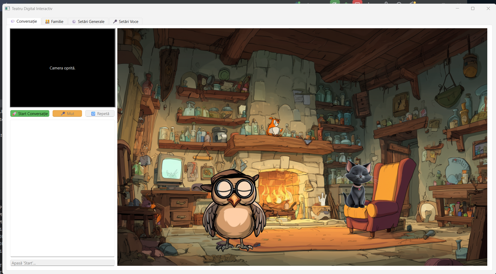

<!-- omit in toc -->

# 🎭 Teatru Digital Interactiv – „Cucuvel & Rina”
Conversații animate cu personaje AI care văd, aud și învață împreună cu tine.




&lt;!-- TOC --&gt;
* [🎭 Teatru Digital Interactiv – „Cucuvel & Rina”](#-teatru-digital-interactiv--cucuvel--rina)
  * [✨ Ce face aplicația](#-ce-face-aplicația)
  * [🧠 Funcții principale](#-funcții-principipale)
  * [🎬 Demo rapid](#-demo-rapid)
  * [🚀 Instalare](#-instalare)
  * [⚙️ Configurare](#️-configurare)
  * [🎮 Cum folosești](#-cum-folosești)
  * [🔧 Extindere](#-extindere)
  * [📸 Capturi ecran](#-capturi-ecran)
  * [🛠️ Tehnologii](#️-tehnologii)
  * [📄 Licență](#-licență)
&lt;!-- TOC --&gt;

---

## ✨ Ce face aplicația

| **Copiii spun** | **Cucuvel & Rina răspund** |
|-----------------|----------------------------|
| „Cucuvel, hai la școală!” | teleportare împreună, lecție personalizată |
| „Rina, traduce-mi!” | subtitrare fonetică + traducere audio |
| „Vreau să învăț culorile!” | modul profesor cu întrebări și validare vizuală |
| *(vorbește în microfon)* | recunoaștere vocală + identificare vorbitor |

&gt; Personajele **te văd**, **te aud**, **te recunosc** și **învață împreună cu tine**.

---

## 🧠 Funcții principale

| Conversație naturală | Navigare & scene | Învățare personalizată |
|----------------------|------------------|------------------------|
| VAD neural (Silero) | teleportare cu personaje | curriculum pe nivele |
| Identificare vocală | summon / send | validare vizuală AI |
| Traducere în timp real | gaze tracking | progres per copil |
| Emoții & animații | fundaluri animate | rapoarte CSV/JSON |

---

## 🎬 Demo rapid

[](&lt;!-- link YouTube / demo --&gt;)

---

## 🚀 Instalare

### 1. Clonează repo-ul
```bash
git clone https://github.com/&lt;user&gt;/teatru-digital-cucuvel.git
cd teatru-digital-cucuvel